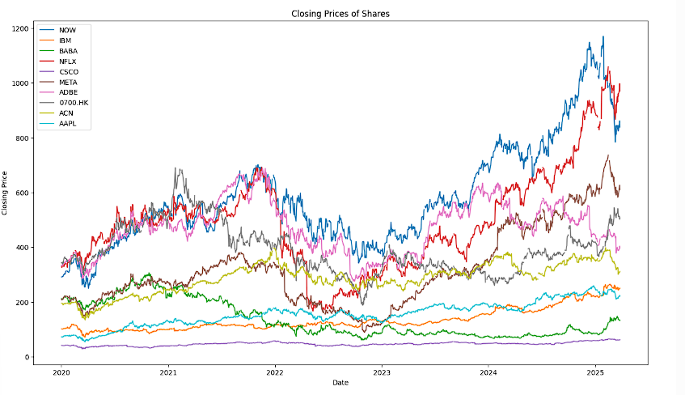
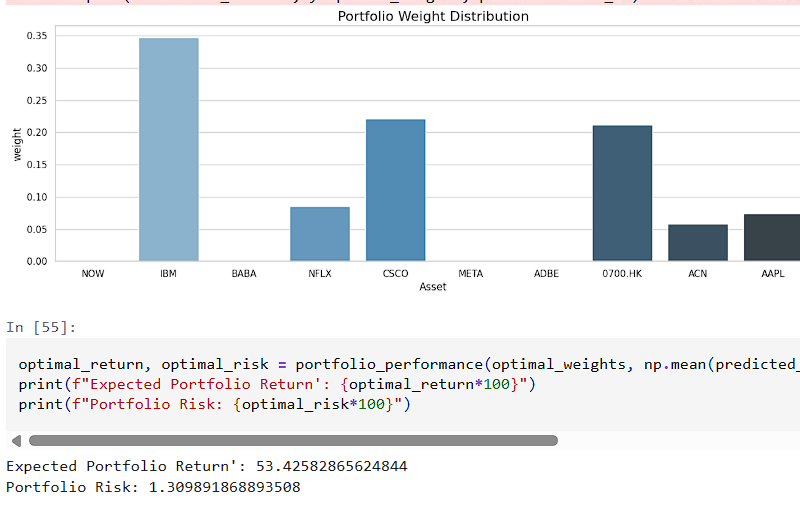
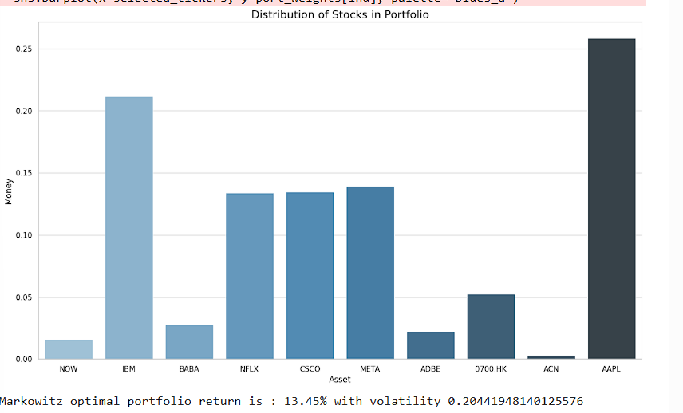

# Projects
This project demonstrates Modern Portfolio Theory in Python. Using historical stock data, it calculates expected returns, volatility, and the covariance matrix of assets to construct the efficient frontier and find the optimal allocation of assets."
 ## 🔧 Tools & Libraries
- Python 3.x
- Pandas, NumPy
- Matplotlib, Seaborn
- SciPy Optimizer / PyPortfolioOpt
  ## 🚀 Features
- Import and process historical stock data
- Calculate daily & annual returns
- Compute risk, volatility, and Sharpe Ratio
- Construct the **Efficient Frontier**
- Identify the **optimal portfolio weights**
- Visualize results with clear charts
  ## 📊 Example Outputs
 ## Closing Prices of Stocks

This line chart shows the historical closing prices of the selected stocks over time. It provides the raw data trends that form the foundation for portfolio optimization.

### Portfolio Weights Distribution

This bar chart displays the optimal percentage allocation of each stock in the portfolio. These weights are determined by the optimizer to achieve the best balance between risk and return.

### Distributed stocks

 This visualization shows how different stocks are distributed across the portfolio. By analyzing the spread of stocks, investors can understand diversification and exposure to different assets. A well-distributed portfolio reduces risk by avoiding over-concentration in a single stock.
